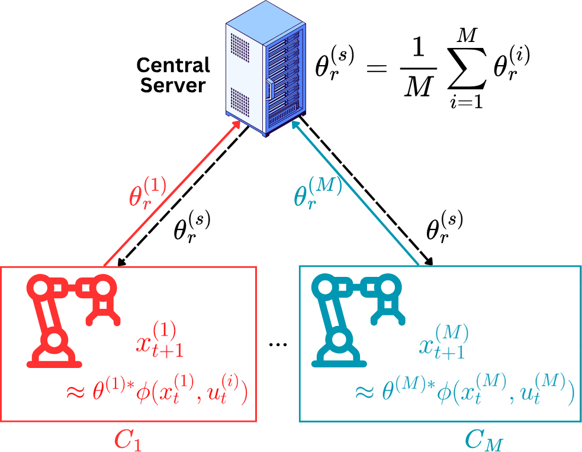

# FNSysId

1. One folder for nonlinear fedsysid including citing of the paper
2. Another folder containing the 2 .ipynb for the pendulum and quadrotor then corresponding .py files

Omkar Tupe*,Max Hartman*,Lav Varshney,Saurav Prakash

<figure class="second">
    
</figure>
